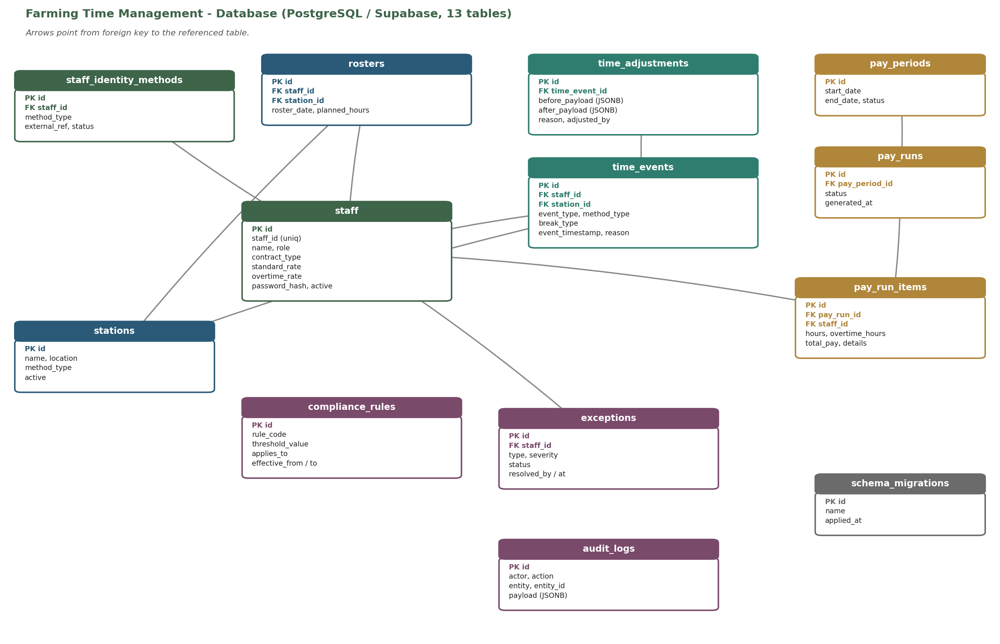

# Database ER Diagram - As-Built (DB Admin)

PostgreSQL / Supabase implementation, **13 tables**. Generated from `apps/api/db/clean_create.sql`.

Arrows point from the foreign key to the referenced table.
